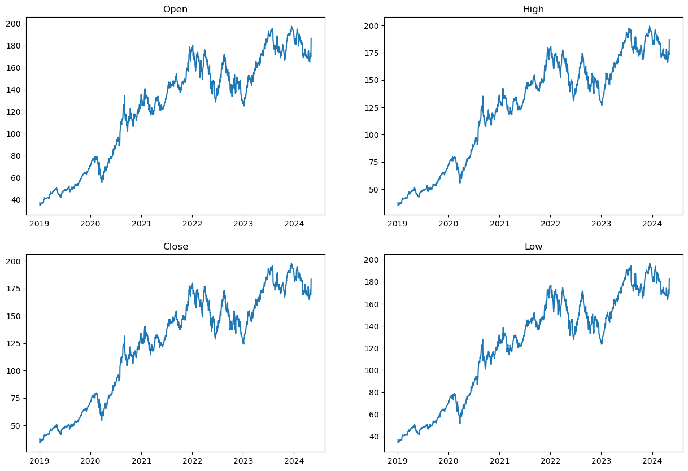
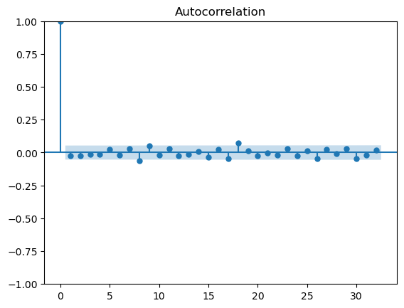
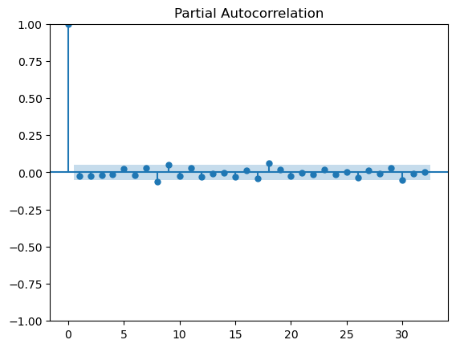
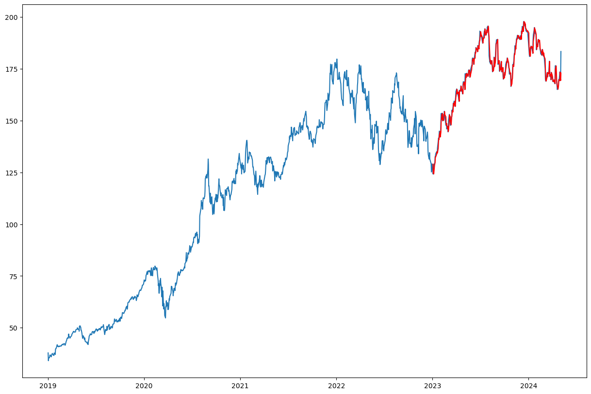
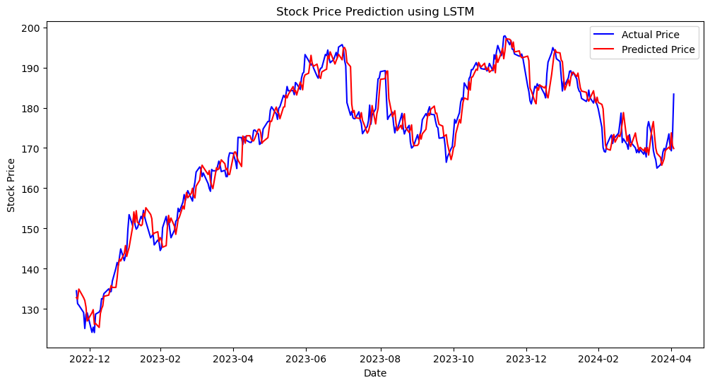
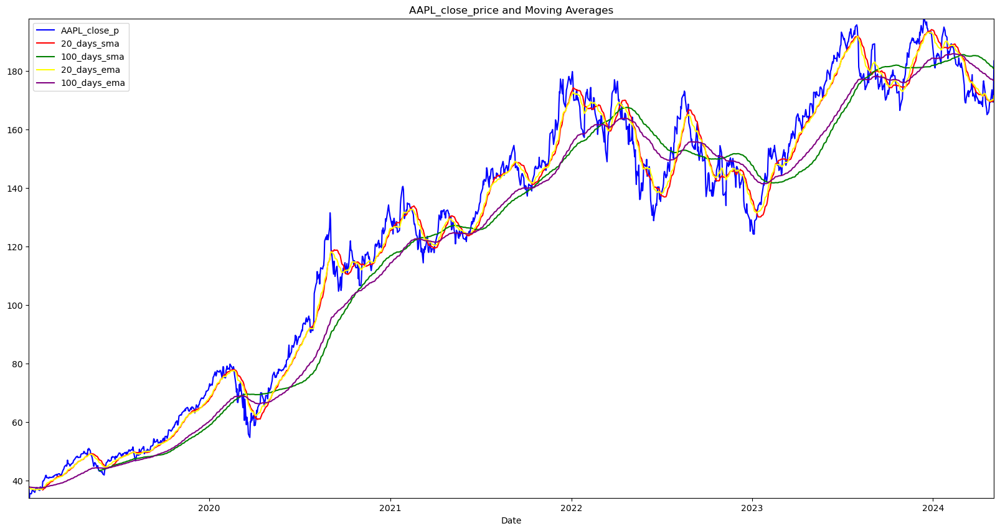

# 数据科学——股票预测

## 股票预测任务

- **股票价格预测**：使用时间序列进行预测已判断金融资产的未来价值。可能包含其他因素包括身体，理性非理性行为。
- **股票趋势预测**：股票通常分为上涨、下跌和横盘。股票趋势预测主要是根据一段交易日内调整后的股票收盘价之间的差异，将趋势形式化。
- **投资组合管理**：需要满足目标和风险承担能力
- **交易策略**：交易策略是一套预先确定的准则和标准，用于做出决策设计投资风格、市值、技术指标、基本面分析、投资组合多样化水平、风险承受能力和杠杆等因素。在深度学习的股市预测任务中，交易策略主要包括事件驱动、交易数据驱动和策略优化。

## 股票价格预测

1. **使用 ARIMA 模型（自回归积分滑动平均模型）**

- 模型的工作原理：

  - （AR， autoRegression 自回归部分）：参数 p ，决定预测值和前 p 个值有关
  - （I， Integrated 差分）: 参数 d ， 输入到模型的数据要确保平稳性，所以 d 是对数据差分的阶数
  - （MA， Moving Average 移动平均部分）： 参数 q, 当前时间序列值和前 q 个时间点的误差项之间的关系，也就是通过前面数据预测值和真实值的**误差**进行预测
- 对于股票数据的预处理，参数决策：

股票数据一般都不是平稳性的，例如图 1.1：



所以我们可以通过 ADF 检验和自相关图非自相关图进行判断。自相关图说明的是当前时间序列数据和过去数据的相关系，而偏自相关性图说明的是目前第 t 个时间序列数据和第 t-k 个数据的相关系，排除了 t 数据前 k 个数据的干扰。

```python
result = adfuller(close_price)
ADF_statistic = result[0]
p_value = result[1]
critical_values = result[4]
print('ADF Statistic:', ADF_statistic)
print('p-value:', p_value)
print('Critical Values:', critical_values)

if p_value < 0.05:
    print('平稳')
    plot_acf(close_price)
    plot_pacf(close_price)
else:
    print('不平稳')
    diff_close_price = close_price.diff().dropna()
    diff_result = adfuller(diff_close_price)
    diff_ADF_statistic = diff_result[0]
    diff_p_value = diff_result[1]
    print('ADF Statistic:', diff_ADF_statistic)
    print('p-value:', diff_p_value)
    plot_acf(diff_close_price)
    # 绘制ACF和PACF图
    plot_pacf(diff_close_price)
```




- 预测结果和评估模型

  - 将数据集进行切割，然后利用训练集进行训练, 将训练集预测出来的结果和测试集进行拟合

  

  - 利用 RSEM（均方根误差）和 AIC（Akaike 信息准则）进行模型评估，值越小越好

1. **使用 LSTM 模型**

- LSTM 工作原理：
  输入门（Input Gate）：控制新的信息能否被加入到记忆单元中。
  遗忘门（Forget Gate）：决定记忆单元中哪些信息应该被遗忘
  输出门（Output Gate）：决定从记忆单元中输出哪些信息。
  细胞状态（Cell State）：它是 LSTM 的“长时记忆”，存储了上下文信息，可以跨越多个时间步。
  隐藏状态（Hidden State）：它是 LSTM 的“短时记忆”，也就是 LSTM 在当前时间步的输出。
- 数据预处理：

  1. 对数据进行归一化，最后记得将标准化后的预测数据转化为原始数据
  2. 进行数据集的切分，并且规定好训练批次和 dataloader
- 模型的训练和拟合：损失函数和优化器的制定



- 最后对模型进行评估并且预测未来的价格：

## 股票趋势预测

1. 移动平均，主要掌握 SMA(简单移动平均) 和 EMA(指数移动平均)

移动平均主要是用来通过一段时间的平均值来判断股票价格的变动情况，消除短期波动，重点关注长期变化。从金融角度来看，移动平均线水平可以解释为市场下跌时的支撑，或者市场上涨时的阻力



## **投资组合管理**
